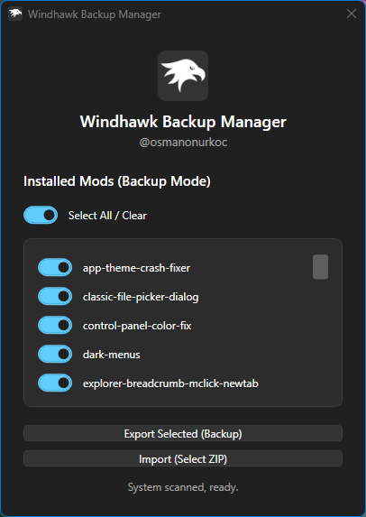
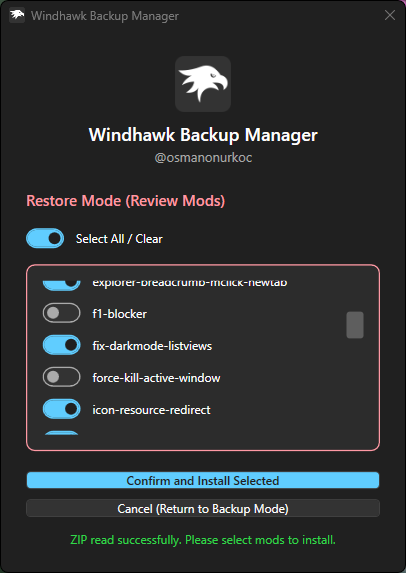

<p align="center">
  <h2 align="center">Windhawk Backup Manager</h2>
  <p align="center">A clean, modern utility to back up and restore your Windhawk configuration and mods.</p>
</p>

---

[](https://github.com/osmanonurkoc/Windhawk-Backup-Manager/releases/latest)


## 📸 Screenshots

<p align="center">
  
  
</p>

### Overview

Windhawk doesn't come with an official export or backup button out of the box. If you are setting up a fresh Windows installation or moving to a new machine, re-downloading and re-configuring all your mods manually can be a headache. 

**Windhawk Backup Manager** solves this by offering a native Windows 11 Fluent Design interface that gives you granular, selective control over what you back up or restore—including your registry settings, compiled engine binaries (`Engine\Mods`), and your custom local mod sources (`ModsSource`).

---

### Key Features

* **Selective Backup & Restore:** Review your installed mods in a clean checklist and choose precisely what goes into your backup ZIP.
* **Smart Local Source Handling:** Automatically targets and packs local source files (`local@...`) while leaving standard repository-based mods to fetch from official sources.
* **Precise Binary Matching:** Uses registry mapping (`LibraryFileName`) to ensure compiled mod files match correctly without pulling legacy clutter.
* **Fluent Design & Auto-Theming:** Automatically detects your Windows Dark/Light mode preference and styles itself natively with WinUI 3 inspired toggle switches and overlay scrollbars.
* **Auto-Elevation:** Automatically handles administrator privileges required to manage the Windhawk service and system-level directories.

---

### How to Use

You can run this tool either as a pre-compiled executable or directly via the PowerShell script.

#### Option A: Running the Executable (`.exe`)
1. Download the latest release `.exe` from the Releases page.
2. Double-click the application. 
3. *Note:* The application will automatically prompt you for Administrator privileges via a UAC pop-up because it needs access to `C:\ProgramData\Windhawk` and system services.

#### Option B: Running the PowerShell Script (`.ps1`)
If you prefer running the raw script directly:
1. Download the `Windhawk_Backup_Manager.ps1` file.
2. Right-click the file and select **Run with PowerShell** (or run it from an elevated terminal). 

> **Important Note on PowerShell Execution Policy:**
> By default, Windows restricts running local scripts for security reasons. If you encounter an error stating that *script execution is disabled on this system*, you can temporarily bypass it for the current terminal session by opening PowerShell as Administrator and running:
> ```powershell
> Set-ExecutionPolicy Bypass -Scope Process -Force
> ```
> After running that command, you can launch the script normally.

---

### Author

Built by **Osman Onur Koç**  
🌐 [www.osmanonurkoc.com](https://www.www.osmanonurkoc.com)

---

### License

This project is licensed under the [MIT License](LICENSE).
